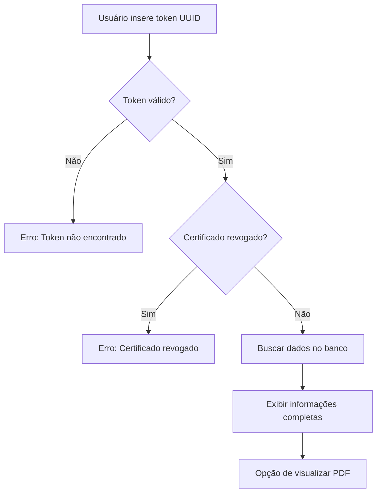
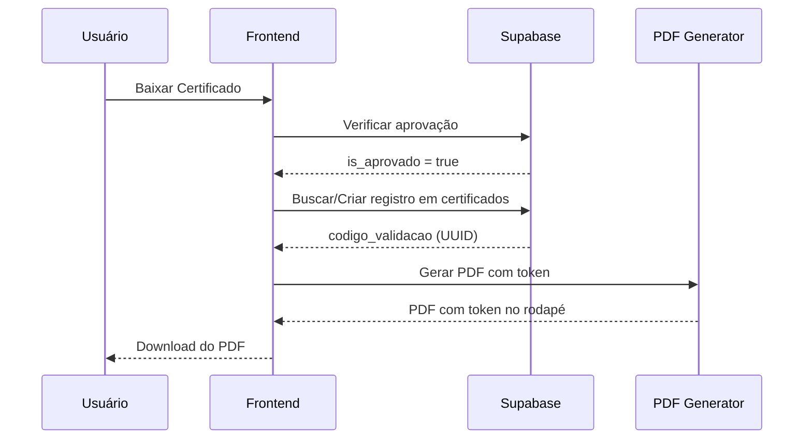

# 🔐 Sistema de Verificação de Certificados

## 📋 Visão Geral

Sistema completo de validação de autenticidade de certificados através de **tokens únicos (UUID)**. 

Permite que qualquer pessoa (usuário, administrador ou visitante) verifique se um certificado é autêntico inserindo o código de validação.

---

## ✨ Funcionalidades Implementadas

### ✅ **1. Token de Validação Único**
- Cada certificado possui um **código de validação** (UUID) único
- O token está armazenado no banco de dados na tabela `certificados`
- Campo: `codigo_validacao` (tipo: UUID)

### ✅ **2. Exibição do Token no Certificado**
- Token é impresso no **rodapé do certificado PDF**
- Formato: `Token de validação: 550e8400-e29b-41d4-a716-446655440000`
- Localização: Parte inferior do certificado, acima do rodapé institucional

### ✅ **3. Tela de Verificação - Administrador**
- Nova opção no menu lateral: **"Verificar Certificado"** (ícone de escudo 🛡️)
- Componente: `/components/VerifyCertificate.tsx`
- Acessível em: Menu Admin → Verificar Certificado

### ✅ **4. Tela de Verificação - Usuário**
- Nova opção na navbar: **"Verificar Certificado"** (ícone de escudo 🛡️)
- Mesmo componente usado pelo administrador
- Acessível em: Menu Usuário → Verificar Certificado

### ✅ **5. Validação em Tempo Real**
- Busca no banco de dados Supabase
- Função: `validarCertificado(codigoValidacao: string)`
- Retorna todos os dados do certificado se válido
- Verifica se o certificado NÃO está revogado (`is_revogado = false`)

---

## 🎯 Como Usar

### **Para Verificar um Certificado:**

#### 1️⃣ **Localizar o Código de Validação**
- Olhe no **rodapé do certificado PDF**
- Procure por: `Token de validação: [código UUID]`
- Exemplo: `550e8400-e29b-41d4-a716-446655440000`

#### 2️⃣ **Acessar a Tela de Verificação**

**Como Administrador:**
```
Login → Menu Lateral → Verificar Certificado
```

**Como Usuário:**
```
Login → Menu Superior → Verificar Certificado
```

**Como Visitante:**
```
Acesse a tela de verificação pública (se disponível)
```

#### 3️⃣ **Inserir o Código**
1. Cole ou digite o código UUID completo
2. Clique em **"Verificar"**
3. Aguarde a validação

#### 4️⃣ **Visualizar Resultado**

**✅ Certificado Válido:**
- Card verde com ícone de confirmação
- Exibe todas as informações:
  - Nome do participante
  - Email do participante
  - Nome do evento
  - Data de início do evento
  - Duração do evento
  - Data de emissão do certificado
  - Número de check-ins
  - Status de aprovação
- Link para visualizar o PDF (se disponível)

**❌ Certificado Inválido:**
- Mensagem de erro em vermelho
- Motivos possíveis:
  - Código não encontrado
  - Certificado revogado
  - Formato de código inválido

---

## 🗂️ Estrutura do Banco de Dados

### **Tabela: `certificados`**
```sql
CREATE TABLE certificados (
  id BIGSERIAL PRIMARY KEY,
  participacao_id BIGINT NOT NULL REFERENCES participacoes(id),
  codigo_validacao UUID UNIQUE NOT NULL DEFAULT gen_random_uuid(),
  data_emissao TIMESTAMPTZ NOT NULL DEFAULT now(),
  url_pdf TEXT,
  is_revogado BOOLEAN DEFAULT false,
  
  CONSTRAINT fk_participacao 
    FOREIGN KEY (participacao_id) 
    REFERENCES participacoes(id) 
    ON DELETE CASCADE
);
```

### **Joins Necessários:**
```sql
SELECT 
  c.*,
  p.usuario_id,
  p.evento_id,
  p.inscrito_em,
  p.pagamento_status,
  p.numero_presencas,
  p.is_aprovado,
  e.nome AS evento_nome,
  e.data_inicio,
  e.duracao_horas,
  u.nome AS participante_nome,
  u.email AS participante_email
FROM certificados c
INNER JOIN participacoes p ON c.participacao_id = p.id
INNER JOIN eventos e ON p.evento_id = e.id
INNER JOIN usuarios u ON p.usuario_id = u.id
WHERE c.codigo_validacao = 'UUID_AQUI'
  AND c.is_revogado = false;
```

---

## 📁 Arquivos do Sistema

### **Componentes:**
```
/components/VerifyCertificate.tsx
  → Interface de verificação (admin + usuário)
  
/components/CertificateGenerator.tsx
  → Gerador de PDF com token incluso
```

### **Serviços:**
```
/services/supabase.ts
  → validarCertificado(codigoValidacao: string)
  
/services/certificates.ts
  → downloadCertificate() com token
```

### **Configuração:**
```
/App.tsx
  → Rotas admin e usuário
  
/components/AdminSidebar.tsx
  → Menu do administrador
  
/components/UserNavbar.tsx
  → Menu do usuário
  
/types/index.ts
  → Interface CertificadoCompleto
```

---

## 🔍 Fluxo de Verificação



---

## 🧪 Como Testar

### **Teste 1: Criar Certificado de Teste**
```sql
-- 1. Criar participação
INSERT INTO participacoes (usuario_id, evento_id, pagamento_status, is_aprovado)
VALUES ('uuid-usuario', 1, 'confirmado', true);

-- 2. Criar certificado
INSERT INTO certificados (participacao_id, url_pdf)
VALUES (
  (SELECT id FROM participacoes WHERE usuario_id = 'uuid-usuario' AND evento_id = 1),
  'https://exemplo.com/certificado.pdf'
);

-- 3. Copiar o codigo_validacao gerado
SELECT codigo_validacao FROM certificados 
WHERE participacao_id = (
  SELECT id FROM participacoes WHERE usuario_id = 'uuid-usuario' AND evento_id = 1
);
```

### **Teste 2: Verificar Certificado**
1. Copie o `codigo_validacao` do SQL acima
2. Faça login como admin ou usuário
3. Vá em **Verificar Certificado**
4. Cole o código e clique em **Verificar**
5. Deve exibir todas as informações do certificado ✅

### **Teste 3: Token Inválido**
1. Digite um UUID aleatório: `00000000-0000-0000-0000-000000000000`
2. Clique em **Verificar**
3. Deve exibir erro: "Certificado não encontrado" ❌

### **Teste 4: Certificado Revogado**
```sql
-- Revogar certificado
UPDATE certificados 
SET is_revogado = true 
WHERE codigo_validacao = 'UUID_AQUI';

-- Tentar verificar
-- Deve retornar null (certificado não encontrado)
```

---

## 📊 Interface de Verificação

### **Campos do Formulário:**
- **Input:** Código de validação (UUID)
- **Placeholder:** `Ex: 550e8400-e29b-41d4-a716-446655440000`
- **Botão:** Verificar (azul, com ícone de lupa)

### **Resultado - Certificado Válido:**
```
┌────────────────────────────────────────────┐
│ ✅ Certificado Válido                      │
│ Este certificado é autêntico               │
├────────────────────────────────────────────┤
│                                            │
│ 🔑 Token: 550e8400-e29b-41d4-a716-446655 │
│                                            │
│ 👤 Participante:                           │
│    João Silva                              │
│    joao@email.com                          │
│                                            │
│ 📄 Evento:                                 │
│    Workshop de React Avançado              │
│    Início: 15 de Janeiro de 2025           │
│    Duração: 40h                            │
│                                            │
│ 📅 Data de Emissão:                        │
│    20 de Janeiro de 2025                   │
│                                            │
│ ✓ Frequência:                              │
│    35 check-ins registrados                │
│    Participação Aprovada                   │
│                                            │
│ [Visualizar Certificado PDF]               │
│                                            │
│ ℹ️ Este certificado foi verificado em      │
│   tempo real no banco de dados oficial     │
└────────────────────────────────────────────┘
```

### **Resultado - Erro:**
```
┌────────────────────────────────────────────┐
│ ❌ Certificado não encontrado ou inválido  │
│ Verifique o código e tente novamente.     │
└────────────────────────────────────────────┘
```

---

## 🔒 Segurança

### **Medidas Implementadas:**

1. ✅ **UUID Único:**
   - Impossível de adivinhar
   - Gerado automaticamente pelo banco
   - 128 bits de entropia

2. ✅ **Validação no Banco:**
   - Não há cache
   - Verifica em tempo real
   - Previne falsificação

3. ✅ **Status de Revogação:**
   - Certificados podem ser revogados
   - Campo `is_revogado` na tabela
   - Certificados revogados não aparecem na verificação

4. ✅ **Dados Completos:**
   - Exibe informações detalhadas
   - Impossível forjar certificado apenas com UUID

---

## 🎨 Localização dos Menus

### **Menu do Administrador:**
```
┌─────────────────────────────┐
│ MENU LATERAL                │
├─────────────────────────────┤
│ 📊 Dashboard                │
│ 📅 Eventos                  │
│ ➕ Criar Evento             │
│ 🛡️  Verificar Certificado   │ ← NOVA OPÇÃO
│ ⚙️  Configurações           │
└─────────────────────────────┘
```

### **Menu do Usuário:**
```
┌──────────────────────────────────────────────────────────┐
│ Eventos | Meus Eventos | Verificar Certificado | Perfil │
│                          ↑ NOVA OPÇÃO                    │
└──────────────────────────────────────────────────────────┘
```

---

## 🔄 Fluxo de Geração de Certificado



---

## ⚠️ Observações Importantes

### **Sobre Tokens:**
- ⚠️ **ATENÇÃO:** O token gerado no frontend é temporário
- ✅ **RECOMENDADO:** Implementar geração e salvamento no backend
- 📝 **TODO:** Salvar certificado na tabela ao gerar PDF

### **Próximos Passos:**
1. Integrar geração de certificado com tabela do banco
2. Salvar URL do PDF no campo `url_pdf`
3. Implementar storage para PDFs (Supabase Storage)
4. Adicionar endpoint para download seguro de PDFs

---

## 📖 Exemplos de Código

### **Verificar Certificado (Frontend):**
```typescript
import { validarCertificado } from './services/supabase';

const handleVerify = async (token: string) => {
  const certificado = await validarCertificado(token);
  
  if (certificado) {
    console.log('✅ Certificado válido:', certificado);
    // Exibir informações
  } else {
    console.log('❌ Certificado inválido');
    // Exibir erro
  }
};
```

### **Buscar Certificado (Backend/SQL):**
```sql
-- Buscar certificado por token
SELECT * FROM certificados
WHERE codigo_validacao = '550e8400-e29b-41d4-a716-446655440000'
  AND is_revogado = false;
```

### **Gerar Certificado com Token:**
```typescript
import { generateCertificate } from './components/CertificateGenerator';

generateCertificate({
  participantName: 'João Silva',
  eventName: 'Workshop React',
  eventStartDate: '2025-01-15',
  eventEndDate: '2025-01-20',
  totalHours: 40,
  attendedHours: 35,
  validationToken: '550e8400-e29b-41d4-a716-446655440000', // UUID do banco
});
```

---

## 🚀 Deploy e Produção

### **Checklist Pré-Deploy:**

- [ ] Verificar se tabela `certificados` existe
- [ ] Confirmar que `codigo_validacao` é UNIQUE
- [ ] Testar validação com certificado real
- [ ] Verificar permissões RLS do Supabase
- [ ] Testar revogar e verificar certificado revogado
- [ ] Adicionar índice em `codigo_validacao` para performance
- [ ] Implementar rate limiting na verificação (prevenir spam)

### **SQL de Índice:**
```sql
-- Melhorar performance de busca por token
CREATE INDEX idx_certificados_codigo_validacao 
ON certificados(codigo_validacao)
WHERE is_revogado = false;
```

---

## 📚 Referências

- **Componente de Verificação:** `/components/VerifyCertificate.tsx`
- **Função de Validação:** `/services/supabase.ts` → `validarCertificado()`
- **Gerador de PDF:** `/components/CertificateGenerator.tsx`
- **Tipos:** `/types/index.ts` → `Certificado`, `CertificadoCompleto`

---

## 🆘 Troubleshooting

### **Problema: "Certificado não encontrado"**
**Solução:**
1. Verifique se o código foi copiado corretamente (UUID completo)
2. Confirme que o certificado existe no banco
3. Verifique se `is_revogado = false`

### **Problema: "Dados não aparecem"**
**Solução:**
1. Verifique os JOINs na query SQL
2. Confirme que `participacao_id` está correto
3. Verifique RLS do Supabase (permissões de SELECT)

### **Problema: "Token não aparece no PDF"**
**Solução:**
1. Verifique se `validationToken` está sendo passado
2. Confirme que `/components/CertificateGenerator.tsx` foi atualizado
3. Verifique logs do console: `console.log('Token:', validationToken)`

---

**Sistema implementado e documentado em:** 25/11/2025  
**Status:** ✅ **OPERACIONAL**  
**Versão:** 1.0.0
